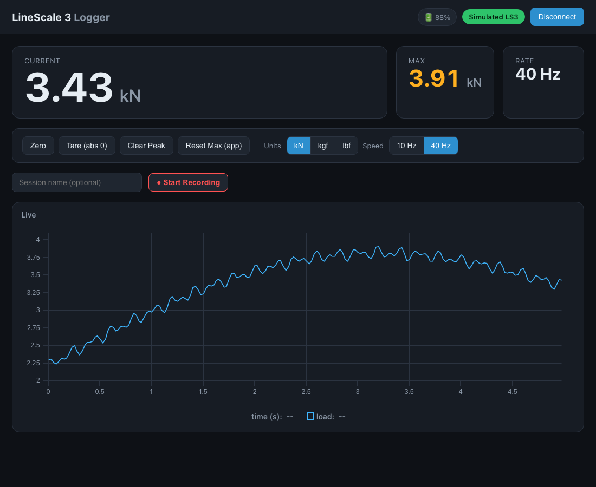

# Dyno-Meter

Load-cell logger for the **LineGrip LineScale 3** and **Rock Exotica Enforcer** (over
Web Bluetooth), with a live **GoPro** video feed, synchronized recording, graphs, and
CSV / PNG / MP4 export. Runs as a **cross-platform desktop app (Electron)** or as a plain
web app in Chrome/Edge — one codebase.



## Features
- **Live readouts** — current load, session max, sample rate, battery %, overload alert.
- **Live graph** — streaming force curve (last 60 s), powered by [uPlot](https://github.com/leeoniya/uPlot).
- **Recording** — name a session, start/stop, and it's saved to your browser (IndexedDB).
- **Sessions** — view any saved recording's full graph, rename it, export CSV, or delete.
- **Device controls** — Zero, Tare (set absolute zero), single **reset** (clears the
  app max and the device peak), switch units (kN / kgf / lbf).
- **Settings** (gear, top right) — show/hide the debug panel, clear-graph-on-record
  toggle, live-graph window, and device settings: refresh rate (10 / 40 Hz), zero mode
  (relative / absolute), power-off. (Onboard logging, auto-logging, auto power-off and
  the power-save lock are device-menu-only — the LS3 doesn't expose them over Bluetooth.)
- **Simulator** — a built-in fake device so you can try everything without hardware.

## Running it

### Desktop app (Electron) — recommended
Bundles everything (ffmpeg included), runs the GoPro bridge in-process (no separate
launcher), and works on macOS / Windows / Linux:

```sh
npm install     # once
npm start       # launch the app
npm run dist    # build an installer for the current platform
```

The camera connects from the in-app **+** menu; `KEYFRAME_S` still tunes live latency
(default `0.1`, `0.033` ≈ every frame). Electron handles the Bluetooth device chooser.

### Web app (Chrome/Edge)
No build step. Web Bluetooth needs a *secure context*, so serve over `localhost`:

```sh
python3 -m http.server 8000     # then open http://localhost:8000
```

(Web Bluetooth isn't in Safari/Firefox.) For the GoPro feed in web mode, run the standalone
bridge separately — see `gopro-bridge/README.md`.

- Connect via the **+** menu (LineScale 3 / Rock Exotica Enforcer / Camera), or open
  `?sim=1` to drive the UI with a fake device.

## How it talks to the device

BLE GATT service `00001000-…`; the app subscribes to notify characteristic
`00001002-…` for 20-byte ASCII data frames and writes single-letter commands to
`00001001-…`. On connect it sends `A` (go online → start streaming) and `F` (40 Hz,
the BLE maximum). Each data frame carries working mode, measured value, zero mode,
reference zero, battery, unit, speed, and a checksum. See `js/protocol.js` for the
full decode — it's a faithful implementation of LineGrip's
*"Communication protocol between LS3 Bluetooth and USB to UART"* spec.

## Project layout
```
index.html        markup
css/styles.css    styling
vendor/uPlot.*    charting library (vendored, no CDN needed)
js/protocol.js    UUIDs, commands, packet parsing  (pure)
js/connection.js  BLEConnection — Web Bluetooth transport + frame buffering
js/simulator.js   fake device implementing the same interface
js/store.js       recordings + IndexedDB persistence + CSV
js/ui.js          DOM + chart
js/app.js         wiring
test/*.test.mjs   Node tests for the protocol + recording logic
```

## Troubleshooting

**Connected but no values?** Open **Settings** (gear, top right) → enable **Show debug
panel**. The panel lists the
device's characteristics on connect, shows the raw bytes / ASCII of every
notification, and live counters (`notifs / frames / parsed / failed`). On connect
the app sends the `A` "go online" command (and re-sends it a few times if no data
arrives). Use the panel to see whether bytes are arriving and whether they parse —
that tells us where the problem is. The same lines are also logged to the browser
console (`[LS3] …`).

## Tests
```sh
node test/protocol.test.mjs   # packet parse, checksum, command CRCs, round-trips
node test/store.test.mjs      # recording accumulation + CSV
```

## Notes / future
- **USB (Web Serial):** the LS3 also streams over USB-serial at up to 1280 Hz using
  the same command/packet protocol. The connection layer is split behind a common
  interface (`Source` in `js/connection.js`), so a `SerialConnection` using the Web
  Serial API can be added alongside `BLEConnection` without touching the rest of the app.
- Recordings are stored locally in your browser; clearing site data removes them.
  Export important sessions to CSV.
